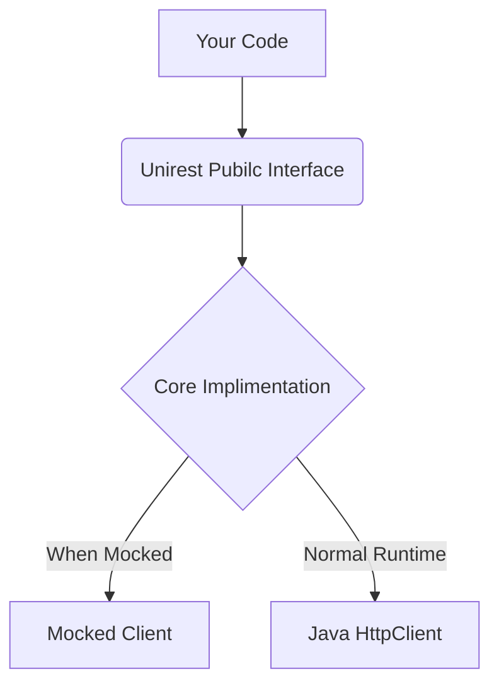

# Unirest Mocks

## About
A series of mocks for use with Unirest for unit testing. Mocked clients will not make any real web requests. This allows you to test the input into unirest and to mock responses from expected requests.



## Expectations
You can either mock the default static implementation or a per instance implementation. In both cases you need to register the mock with Unirest.

### Static Mocking
```java
class MyTest {
    @Test
    void mockStatic(){
        MockClient mock = MockClient.register();

        mock.expect(HttpMethod.GET, "http://zombo.com")
                        .thenReturn("You can do anything!");
        
        assertEquals(
            "You can do anything!", 
            Unirest.get("http://zombo.com").asString().getBody()
        );
    }
}
```

### Instant Mocking
```java
    @Test
    void mockInstant(){
        UnirestInstance unirest = Unirest.spawnInstance();
        MockClient mock = MockClient.register(unirest);
        
        mock.expect(HttpMethod.GET, "http://zombo.com")
                        .thenReturn("You can do anything!");
        
        assertEquals(
            "You can do anything!", 
            unirest.get("http://zombo.com").asString().getBody()
        );
    }
```

## Multiple Expects
HTTP requests can have many parts, some of which are automatic or at least uninteresting from the standpoint of testing. This means that setting up an exact expectation to match the request exactly can be tedious. 

You can register as many expects as you like. Which one is used for any particular invocation of Unirest depends on a points system. Each expectation is evaluated and given points for each positive part while any negative part immediately discards the expect. The expectation that has the most points "wins".

In this example, we have three expectations, one doesn't match at all. and two others match but one does more than the other so the most specific match is used.

```java
    @Test
    void multipleExpects(){
        MockClient mock = MockClient.register();

        mock.expect(HttpMethod.POST, "https://somewhere.bad")
                .thenReturn("I'm Bad");

        mock.expect(HttpMethod.GET, "http://zombo.com")
                .thenReturn("You can do anything!");

        mock.expect(HttpMethod.GET, "http://zombo.com")
                .header("foo", "bar")
                .thenReturn("You can do anything with headers!");

        assertEquals(
                "You can do anything with headers!",
                Unirest.get("http://zombo.com")
                        .header("foo", "bar")
                        .asString().getBody()
        );

        assertEquals(
                "You can do anything!",
                Unirest.get("http://zombo.com")
                        .asString().getBody()
        );
    }
```

## Verifying Expects
Sometimes we only want to know that the needful was done. In this case we can validate our mock. The simplest way is to call verifyAll which will validate that all expects were called at least once.

```java
    @Test
    void verifyAll(){
        MockClient mock = MockClient.register();

        mock.expect(HttpMethod.POST, "http://zombo.com")
                .thenReturn().withStatus(200);

        Unirest.post("http://zombo.com").asString().getBody();

        mock.verifyAll();
    }

```

If you want to get more specific we can keep around our expectations and validate them explicitly. We can also inject a number of times we want to validate (including zero)
```java
    @Test
    void verifyMultiple(){
        MockClient mock = MockClient.register();
    
        var zombo =    mock.expect(HttpMethod.POST, "http://zombo.com").thenReturn();
        var homestar = mock.expect(HttpMethod.DELETE, "http://homestarrunner.com").thenReturn();
    
        Unirest.post("http://zombo.com").asString().getBody();
    
        zombo.verify();
        homestar.verify(Times.never());
    }
```


